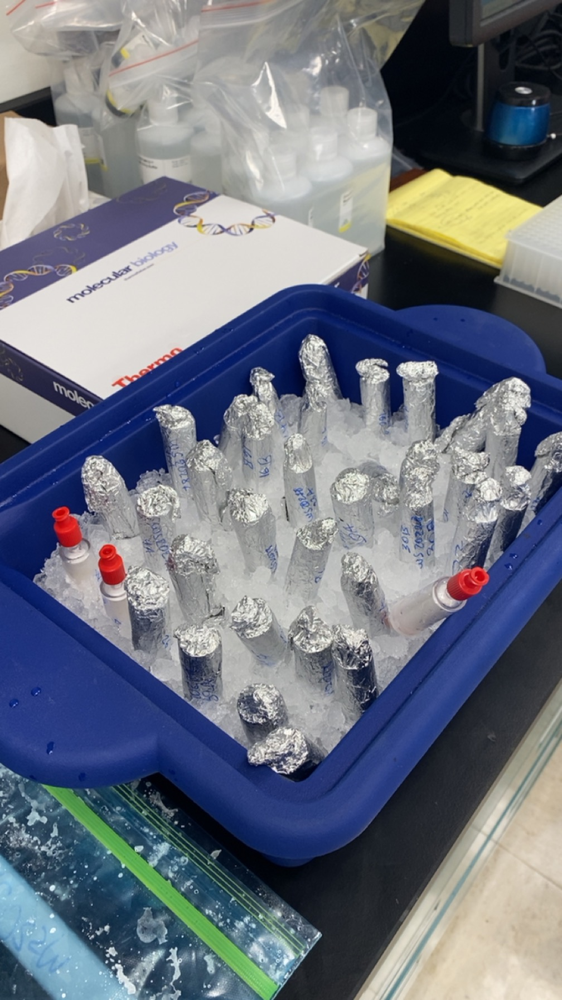

# Python Experiments
This repository contains the intial code I created when learning to use GitHub as part of the DSCI 8133 course, _Foundations of Data Science_ at Mississippi State University.

---

## Plan
Future plans for this repository include adding a sample data file and a [Jupyter](https://jupyter.org/) notebook that will interact with the file.

## About Me
I am Sammy Harding and I work for MSU's NGI as a **laboratory technologist** based out of NOAA's Atlantic Oceanographic and Meteorological Laboratory in Miami, FL.

Mastering data science skills will aid in my ability to better perform my current responsibilities including:

- Sorting and manipulating files of 5,000+ rows of sample metadata
- Creating Python scripts to auto-update CSVs
- Utilize GitHub to upload and share protocols, data, etc.

As a gift to my readers, here is an image of my samples sitting in a bucket of ice before processing them for extractions.

